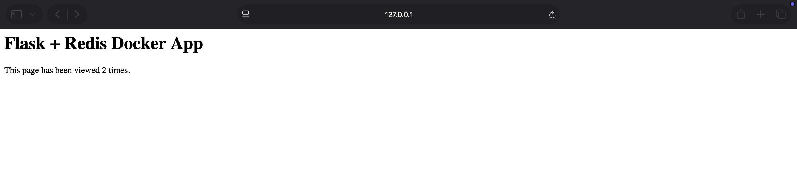
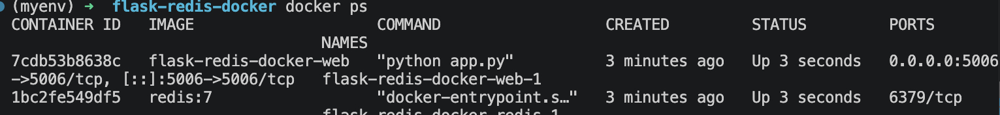
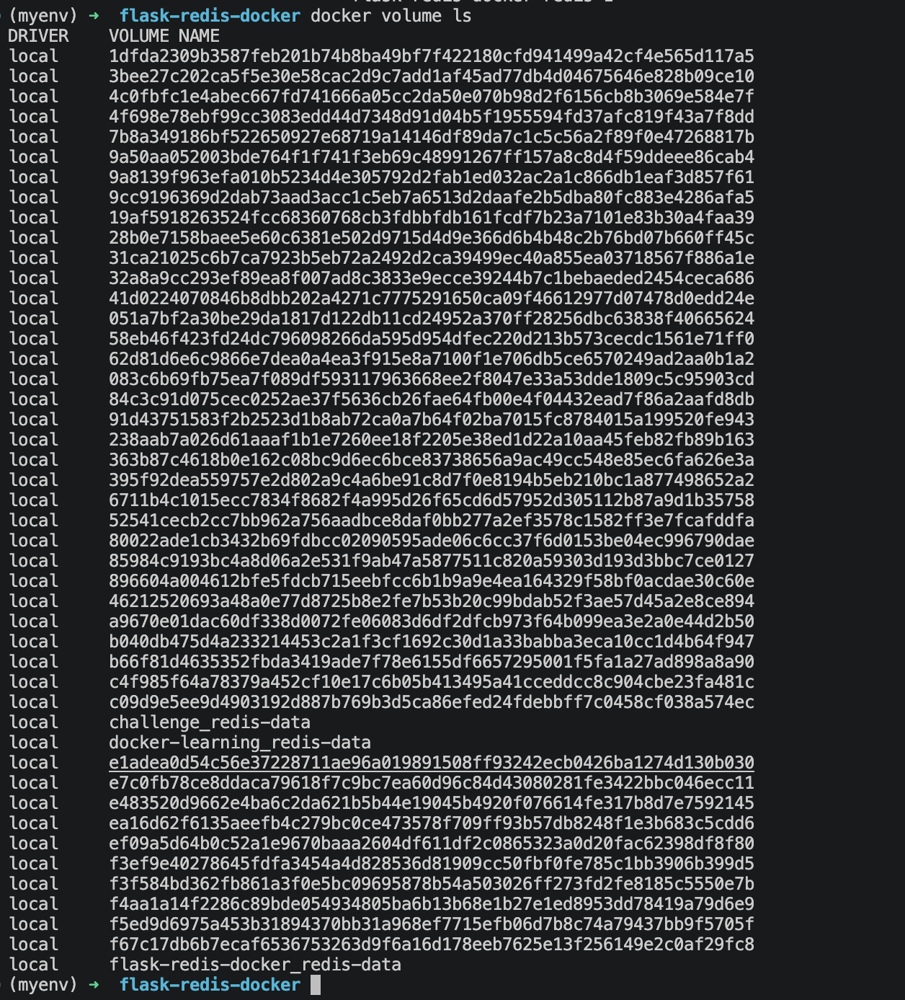
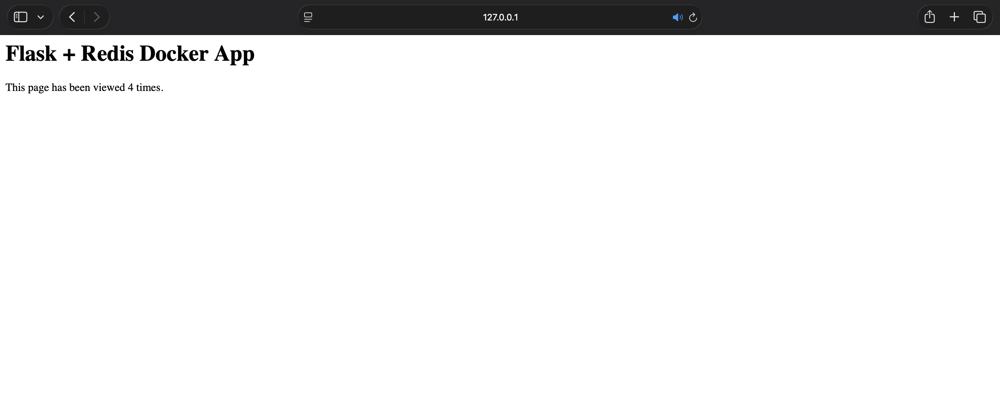

# Flask + Redis Docker Compose Lab

## Overview

This project demonstrates how to containerise a Flask application and Redis using Docker Compose.

The objective was to build a multi-container application where the Flask web application communicates with a Redis database, while Redis data is stored using a persistent Docker volume.

The project demonstrates core Docker concepts including:

- Docker images
- Docker containers
- Dockerfiles
- Docker Compose
- Multi-container applications
- Container networking
- Port mapping
- Docker volumes
- Persistent storage

## Architecture

The application consists of two containers:

- Flask web application
- Redis database

The architecture follows:

Flask Container → Redis Container → Persistent Docker Volume

The Flask application communicates with Redis using the Docker Compose service name `redis`.

## Project Structure

    flask-redis-docker/
    ├── Dockerfile
    ├── docker-compose.yml
    ├── requirements.txt
    ├── .dockerignore
    └── app/
        └── app.py

## Flask Application

The Flask application runs on port `5006`.

The application connects to Redis using:

`redis:6379`

The Redis hostname is `redis`, which is the service name defined in the Docker Compose configuration.

The application maintains a visit counter using Redis.

## Dockerfile

The Dockerfile defines how the Flask application image is built.

The image uses Python 3.12 Slim as the base image.

The Dockerfile:

- Creates the `/app` working directory
- Copies `requirements.txt`
- Installs the Python dependencies
- Copies the Flask application
- Exposes port `5006`
- Starts the Flask application

The application image was built using:

`docker compose up --build`

The `--build` option forces Docker to rebuild the application image before starting the containers.

## Docker Compose

Docker Compose was used to define and run the multi-container application.

The Compose configuration contains two services:

- `web`
- `redis`

The web service builds the Flask application from the Dockerfile and maps port `5006` on the host to port `5006` inside the container.

The Redis service uses the official Redis image.

The services communicate with each other through the Docker Compose network.

## Running Containers

After starting the application with Docker Compose, both the Flask and Redis containers were running simultaneously.

The running containers were verified using:

`docker ps`

## Redis Persistence

A named Docker volume called `redis-data` was created for Redis.

The volume is mounted to Redis so that data is stored outside of the Redis container itself.

This means that the Redis data can survive when the Redis container is removed and recreated.

The Docker volume was verified using:

`docker volume ls`

## Container Networking

Docker Compose automatically creates a network for the application.

The Flask container can communicate with the Redis container using the service name:

`redis`

The Flask application therefore does not need to know the Redis container's IP address.

The connection is:

Flask → `redis:6379`

## Persistent Storage Test

To test persistence, the containers were stopped and removed using:

`docker compose down`

The named Redis volume was kept.

The application was then started again using Docker Compose.

After the containers were recreated, the Redis visit counter continued from its previous value rather than resetting.

This demonstrated that the Redis data was stored in the persistent Docker volume rather than only inside the container.

## Key Docker Concepts Demonstrated

### Image

A Docker image is the packaged template used to create a container.

The Flask image was built from the Dockerfile.

### Container

A container is a running instance created from an image.

This project runs separate containers for Flask and Redis.

### Docker Compose

Docker Compose allows multiple containers and their configuration to be defined and managed together.

In this project, Compose manages the Flask and Redis services.

### Volume

A Docker volume provides persistent storage outside the lifecycle of a container.

The `redis-data` volume allows Redis data to survive container recreation.

### Service Discovery

Docker Compose provides service-to-service networking.

The Flask application connects to Redis using the service name `redis` rather than a manually configured IP address.

## What I Learned

This project provided hands-on experience with:

- Building Docker images
- Running Docker containers
- Writing Dockerfiles
- Docker Compose
- Multi-container applications
- Container networking
- Port mapping
- Redis
- Docker volumes
- Persistent storage
- Service discovery

One of the most important concepts demonstrated was that containers are designed to be replaceable, while persistent data should be stored separately using volumes or other persistent storage mechanisms.

## Final Architecture

Flask Web Container
↓
Redis Container
↓
redis-data Docker Volume

The Flask application handles HTTP requests while Redis stores the visit counter.

## Next Step

This project forms part of my DevOps learning journey.

The next stage is to continue building cloud infrastructure with AWS and move towards managing infrastructure as code using Terraform.
